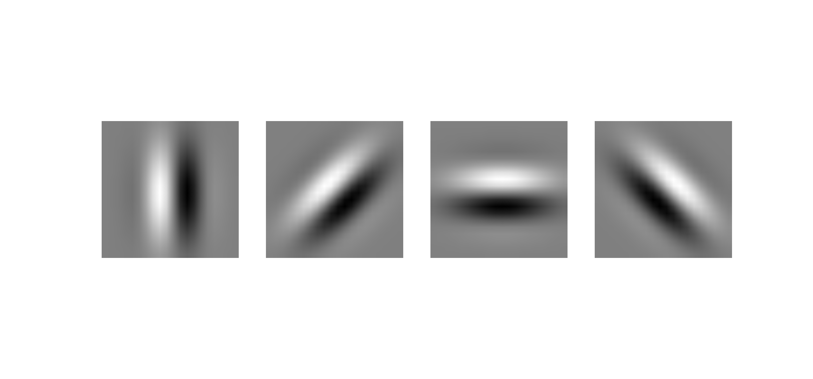
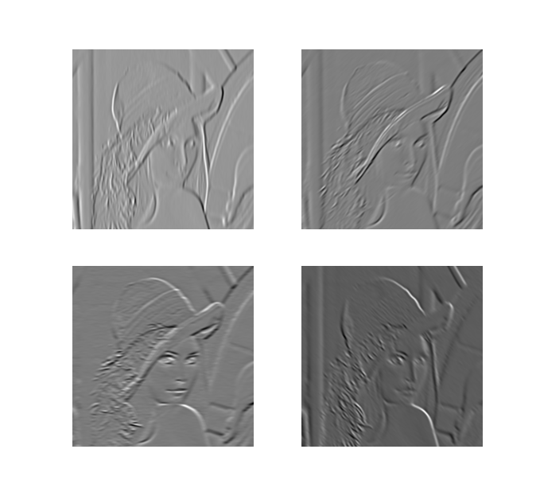

.. _convolution2D:

Fast image filtering using the caching extension
================================================
.. codesnippet::

Here is an example of how to convolve an image with oriented
filters. 2D convolution is notoriously a slow operation; we'll show
how to improve the filtering speed using the caching extension.

For our example, we'll use the famous image of Lena:

    >>> import mdp
    >>> import numpy
    >>> import pylab
    >>> im = pylab.imread('lena.png')
    >>> # transform to grayscale
    >>> im = numpy.sqrt((im[:,:,:3]**2.).mean(2))

.. image:: lena_gray.png
        :width: 400
        :alt: Lena's famous photograph

First, we create a bank of Gabor filters at different orientations:

    >>> # create Gabor filters bank
    >>> pi = numpy.pi
    >>> orientations = [0., pi/4., pi/2., pi*3./4.]
    >>> freq = 1./10    # frequency
    >>> phi = pi/2.     # phase
    >>> size = (20, 20) # in pixels
    >>> sgm = (5., 3.)  # standard deviation of the axes
    >>> 
    >>> nfilters = len(orientations)
    >>> gabors = numpy.empty((nfilters, size[0], size[1]))
    >>> for i, alpha in enumerate(orientations):
    ...     gabors[i,:,:] = mdp.utils.gabor(size, alpha, phi, freq, sgm)

To convolve the image, we use the ``Convolution2DNode`` as follows

    >>> node = mdp.nodes.Convolution2DNode(gabors, mode='valid', boundary='fill',
    ...:                                   fillvalue=0, output_2d=False)
    >>> cim = node.execute(im[numpy.newaxis,:,:])

obtaining these filtered images:

