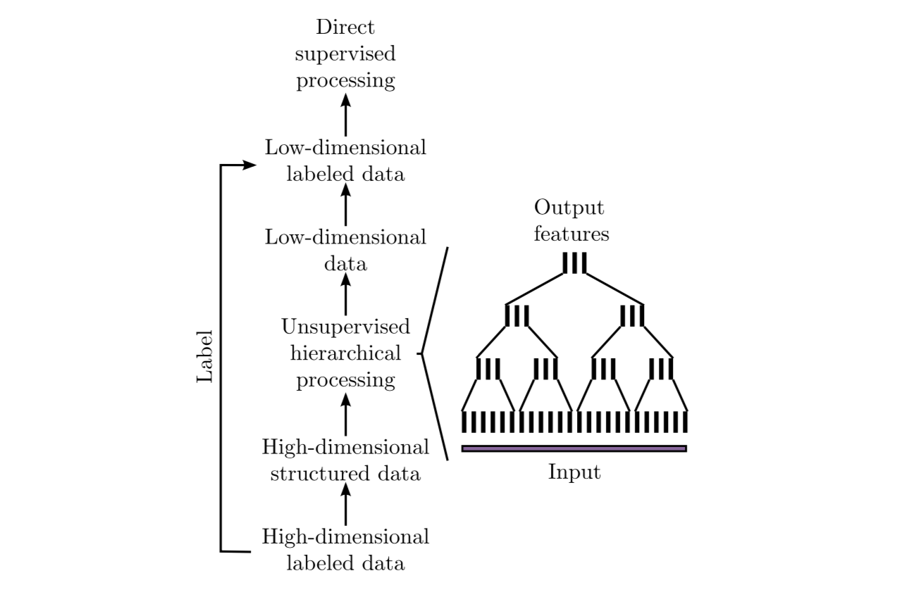
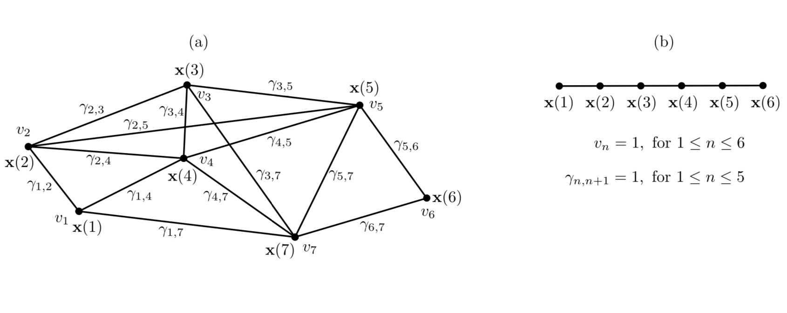

.. _gsfa:

======================
Graph-based SFA (GSFA)
======================
.. codesnippet::

- Extension of Slow Feature Analysis (SFA)

- Supervised dimensionality reduction method

- Trained with a graph in which the vertices are the samples and the
  edges represent similarities of the corresponding labels

Graph-based Slow Feature Analysis (GSFA) is a supervised extension of
SFA [1]_ that relies on a particular graph structure to extract
features that preserve label similarities. More precisely, the algorithm
utilizes training graphs in which the vertices are the samples, and the
edges represent similarities of the corresponding labels. Later, we use
the acquired low-dimensional representation of the original data to train
a typical supervised learning algorithm.

In this example, we briefly explain the idea behind GSFA [2]_ and
specify the optimization task it solves. Moreover, we show the
efficiency of GSFA compared to a support vector machine (SVM) on a toy
dataset and introduce an approach that makes the classification task more
interpretable.

.. contents:: **Table of contents**
   :local:

--------------

.. _Classification using GSFA:

1. Classification using GSFA
----------------------------

To show the benefits of the model and its efficiency, we solve a
classification task based on the
`‘breast_cancer’ <https://scikit-learn.org/stable/modules/generated/sklearn.datasets.load_breast_cancer.html>`__
dataset of the scikit-learn library. More precisely, we use an SVM classifier
as a baseline method and then demonstrate the effect of preprocessing the data
via GSFA.

The breast cancer dataset is a classical and straightforward binary
classification dataset. Features are computed from a digitized image of
a fine needle aspirate (FNA) of breast mass. They describe
characteristics of the cell nuclei present in the image. It can be found
on `UCI Machine Learning
Repository <https://archive.ics.uci.edu/ml/datasets/Breast+Cancer+Wisconsin+%28Diagnostic%29>`__.

**Number of instances:** 569

**Number of attributes:** 30 numeric, predictive attributes and the class

**Attribute information:**

- radius (mean of distances from center to points on the perimeter)
- texture (standard deviation of gray-scale values)
- perimeter
- area
- smoothness (local variation in radius lengths)
- compactness (perimeter² / area - 1.0)
- concavity (severity of concave portions of the contour)
- concave points (number of concave portions of the contour)
- symmetry
- fractal dimension (“coastline approximation” - 1)

*The mean, standard error, and “worst” or largest (mean of the three
worst/largest values) of these features were computed for each image,
resulting in 30 features. For instance, field 0 is “Mean Radius”, field 10
is “Radius SE”, field 20 is “Worst Radius”.*

**Class:**

- WDBC-Malignant
- WDBC-Benign

First, we import the usual data science modules and
`mdp <https://mdp-toolkit.github.io>`__ to use its GSFA
implementation and other data processing tools.

	>>> import matplotlib
	>>> import matplotlib.pyplot as plt
	>>> from sklearn import (datasets, model_selection, metrics)
	>>> from sklearn.svm import SVC

Now, from `sklearn` we load the `breast_cancer` dataset. We’ll use
20% of the data for testing.

	>>> data, label = datasets.load_breast_cancer(return_X_y=True)
	>>> data_train, data_test, label_train, label_test = \
	... model_selection.train_test_split(data, label, test_size=0.2)

We get the baseline SVM classification quality as follows:

**SVM performance on training data:**

	>>> SVM_clf_train = SVC(gamma='auto')
	>>> SVM_clf_train.fit(data_train, label_train)
	>>> SVM_prediction_train = SVM_clf_train.predict(data_train)
	>>> print("SVM train score: ",
	...	metrics.accuracy_score(label_train, SVM_prediction_train))
	SVM train score:  1.0

**SVM performance on test data:**

	>>> SVM_clf_test = SVC(gamma='auto')
	>>> SVM_clf_test.fit(data_train, label_train)
	>>> SVM_prediction_test = SVM_clf_test.predict(data_test)
	>>> print("SVM test score: ",
	...	metrics.accuracy_score(label_test, SVM_prediction_test))
	SVM test score:  0.5877192982456141

Next, we train a GSFA model on the training data such that it computes the
slowest features possible according to the GSFA optimization problem.
Since the label information is encoded in the graph connectivity, the
low-dimensional output is highly predictive for the labels.

We set the output dimension parameter to 2, which allows us to
represent the data in 2D coordinates.

	>>> output_dim = 2
	>>> GSFA_n = mdp.nodes.GSFANode(output_dim=output_dim)
	>>> GSFA_n.train(data_train, train_mode=("classification", label_train, 1))
	>>> GSFA_n.stop_training()
	
This yields projections of the training and test data to the obtained feature space.

	>>> GSFA_train = GSFA_n.execute(data_train)
	>>> GSFA_test = GSFA_n.execute(data_test)

We depict the reduced training and test data on a 2D plot as follows:

	>>> colors = ['red', 'blue']
	>>> f = plt.figure(figsize=(15,6))
	>>> ax = f.add_subplot(121)
	>>> ax2 = f.add_subplot(122)
	>>> ax.scatter(GSFA_train[:, 0], GSFA_train[:, 1], c=label_train,
	...	cmap=matplotlib.colors.ListedColormap(colors))
	>>> ax2.scatter(GSFA_test[:, 0], GSFA_test[:, 1], c=label_test,
	...	cmap=matplotlib.colors.ListedColormap(colors))
	>>> ax.set_title("Train data in 2-D")
	>>> ax2.set_title("Test data in 2-D")
	>>> plt.show()

|
|

.. image:: plots.png
        :width: 700
		
		
**As we can see, GSFA shows good performance in finding features that
separate the data even in a two-dimensional representation.**

We train an SVM on the data transformed with GSFA.

**SVM performance on test data previously transformed with GSFA:**

	>>> GSFA_clf = SVC(gamma='auto')
	>>> GSFA_clf.fit(GSFA_train, label_train)
	>>> GSFA_SVM_test = GSFA_clf.predict(GSFA_test)
	>>> print("GSFA dimension reduction + SVM score: ", metrics.accuracy_score(label_test, GSFA_SVM_test))
	GSFA dimension reduction + SVM score:  0.9649122807017544

**Model comparison**

.. csv-table::
   :header: "classifier", "train_score", "test_score", "training_time"
   :widths: 20, 20, 20, 20

   "SVM", 1.0, 0.588, 0.024
   "GSFA + SVM", 1.0, 0.964, 0.057

--------------

.. _Idea behind GSFA:

2. Idea behind GSFA
-------------------

With a large number of high-dimensional labeled samples, supervised
learning is often not feasible due to prohibitive computational
requirements. In such cases, the following general scheme based
on hierarchical GSFA is proposed:

1\. Transform the labeled data into structured data where the label information is implicitly encoded in the connections between the data points (samples). This permits using unsupervised learning algorithms such as SFA or its extension GSFA.

2\. Use hierarchical processing to reduce the dimensionality, resulting in low-dimensional data with component similarities strongly dependent on the graph connectivity. Since the label information is encoded in the graph connectivity, the low-dimensional data is highly predictive of the labels.

3\. Convert the (low-dimensional) data back to labeled data by combining the low-dimensional data points with the original labels or classes. This constitutes a dataset suitable for standard supervised learning methods because the dimensionality has become manageable.

4\. Use standard supervised learning methods on the low-dimensional labeled data to estimate the labels. The unsupervised hierarchical network, together with the supervised direct method, constitutes the classifier or regression architecture.

In the case of GSFA, the structured training data is called a
*training graph*, a weighted graph that has vertices representing
the samples, vertex weights specifying a priori sample probabilities,
and edge weights indicating desired output similarities derived from the labels.

--------------

.. _Training graphs:

3. Training graphs
-------------------------------------------

The training data is represented as a training graph
:math:`G = (\textbf{V}, \textbf{E})` *(as illustrated in Figure bellow)*
such that:

-  :math:`\textbf{V}` corresponds to the set of :math:`\textbf{x}(n)`
   :math:`\rightarrow` *each vertex of the graph is a sample*

-  Each edge of :math:`\textbf{E}` corresponds to a pair of samples
   :math:`(\textbf{x}(n), \textbf{x}(n'))`

**Weights:**

1\. Edge weights indicate the **similarity between the connected vertices**. Since edges are undirected and have symmetric weights, i.e.,

   .. math:: \gamma_{n, n'} = \gamma_{n', n} \,.

2\. Each vertex  :math:`\textbf{x(}n\textbf{)}` has an associated weight :math:`v_n > 0` that can be used to reflect its importance, frequency, or reliability.

For instance, a sample frequently occurring in an observed phenomenon
should have a larger weight than a rare sample. This representation
includes the standard time series as a special case in which the graph
has a linear structure and all node and edge weights are identical *(as
illustrated in Figure(b))*.

	
--------------

.. _GSFA optimization problem:

4. GSFA optimization problem
----------------------------

The GSFA optimization problem over :math:`N` training samples can be
stated as follows.

**Given**:

:math:`I` - dimensional input
:math:`\textbf{x}(n) = (x_1(n), ..., x_I(n))^T` signal with
:math:`1 \leq n \leq N`

**Find**:

vector-valued function
:math:`\textbf{g}: \mathbb{R}^{I} \rightarrow \mathbb{R}^{J}` within
a function space :math:`\mathcal{F}` such that for each component of the
output signal :math:`\textbf{y}(n) := \textbf{g}(\textbf{x}(n))` (
i.e. each :math:`y_j(n)` for :math:`1 \leq j \leq J`) the objective
function

.. math:: \Delta_j := \frac{1}{R} \sum_{n, n'} \gamma_{n, n'} (y_j(n') - y_j(n))^2 \tag*{(weighted delta value)}

is minimal under the constraints

.. math:: \frac{1}{Q} \sum_{n} v_n y_j(n) = 0 \tag*{(weighted zero mean)}

.. math:: \frac{1}{Q} \sum_{n} v_n (y_j(n))^2 = 1 \tag*{(weighted unit variance)}

.. math:: \frac{1}{Q} \sum_{n} v_n y_j(n) y_{j'}(n)= 0 \quad \text{for all} \,\, j' < j \tag*{(weighted decorrelation)}

with

.. math:: R := \sum_{n, n'} \gamma_{n, n'}

.. math:: Q := \sum_{n} v_n

is optimized.

In practice, the function :math:`\textbf{g}` is usually chosen from a
finite-dimensional function space :math:`\mathcal{F}`, e.g., from the
space of quadratic or linear functions. Highly complex function spaces
should be avoided because they are expensive to handle and may result in
overfitting.

--------------

.. _Linear GSFA Algorithm:

5. Linear GSFA algorithm
------------------------

In this section we consider the solution of the GSFA problem in a linear
function space. Hence, the output components take the form

.. math:: y_j(n) = \textbf{w}_j^{T} (\textbf{x}(n) - \hat{\textbf{x}}) \,,

\ where

.. math:: \hat{\textbf{x}} = \frac{1}{Q} \sum_n v_n \textbf{x}_n \,. \tag*{(weighted average of all samples)}

Thus, in the linear case, the SFA problem reduces to finding an optimal
set of weight vectors :math:`w_j` under the constraints above. It
can be solved by linear algebra methods.

As previously, suppose

1\. Vertices
   :math:`\textbf{V} = \{ \textbf{x}(1), \dots, \textbf{x}(N)\}` are the
   input samples with weights :math:`\{v_1, \dots, v_N\}`, and

2\. Edges :math:`\textbf{E}`
	are the set of edges :math:`(\textbf{x}(n), \textbf{x}(n'))` with
	edge weights :math:`\gamma_{n, n'}`. For non-existing edges
	:math:`(\textbf{x}(n), \textbf{x}(n')) \notin \textbf{E}` set zero
	weights :math:`\gamma_{n, n'} = 0`.

.. rubric:: Step 1: Calculate covariance and second-moment matrices

The sample covariance matrix :math:`\textbf{C}_{G}` is defined as:

.. math:: \textbf{C}_{G} := \frac{1}{Q} \sum_{n} v_n (\textbf{x}(n) - \hat{\textbf{x}})(\textbf{x}(n) - \hat{\textbf{x}})^T = \frac{1}{Q} \sum_{n} (v_n \textbf{x}(n) (\textbf{x}(n))^T ) - \hat{\textbf{x}} \hat{\textbf{x}}^T \,.

The derivative second-moment matrix :math:`\dot{\textbf{C}}_{G}` is
defined as:

.. math:: \dot{\textbf{C}}_{G} := \frac{1}{R} \sum_{n, n'} \gamma_{n, n'} (\textbf{x}(n') - \textbf{x}(n))(\textbf{x}(n') - \textbf{x}(n))^T \,.

.. rubric:: Step 2: Calculate sphering and rotation matrices

A sphering matrix :math:`\textbf{S}` is computed as
:math:`\textbf{S}^T \textbf{C}_{G} \textbf{S} = \textbf{I}`. Then we
derive that a sphered signal
:math:`\textbf{z} := \textbf{S}^T \textbf{x}`.

Afterward, the :math:`J` directions of least variance in the derivative signal
:math:`\dot{\textbf{z}}` are found and represented by an
:math:`I \times J` rotation matrix :math:`\textbf{R}`, such that
:math:`\textbf{R}^T \dot{\textbf{C}}_{z} \textbf{R} = \Lambda`, where
:math:`\dot{\textbf{C}}_{z} := <\dot{\textbf{z}} \dot{\textbf{z}}^T>`
and :math:`\Lambda` is a diagonal matrix with diagonal elements
:math:`\lambda_1 \leq \lambda_2 \leq \dots \leq \lambda_J`.

.. rubric:: Step 3: Calculate the weight matrix

Finally, the algorithm returns the weight matrix
:math:`W = (w_1, \dots, w_J)`, defined as

.. math:: W = SR

and the extracted features are given as

.. math:: y = W^T (\textbf{x}(n) -  \hat{\textbf{x}}) \,,

where

.. math:: \hspace{0.5cm} \Delta(y_j) = \lambda_j \hspace{0.5cm} 1 \leq j \leq J \,.	

--------------

References
------------

.. [1] Wiskott and Sejnowski (2002) `Slow Feature Analysis: Unsupervised Learning of Invariances <https://www.mitpressjournals.org/doi/10.1162/089976602317318938>`__

.. [2] Escalante-B. et al. (2013) `How to Solve Classification and Regression Problems on High-Dimensional Data with a Supervised Extension of Slow Feature Analysis <https://jmlr.csail.mit.edu/papers/v14/escalante13a.html>`__
