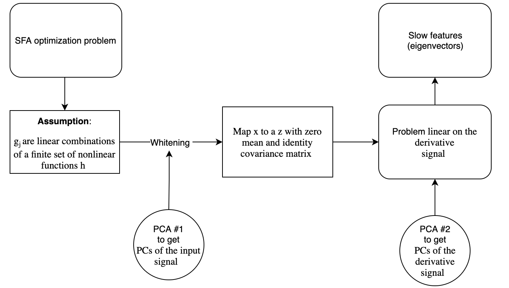
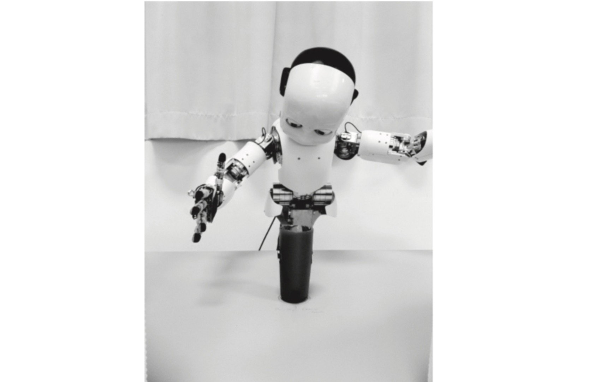
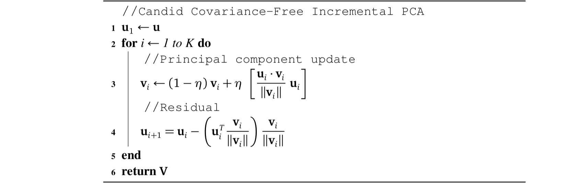
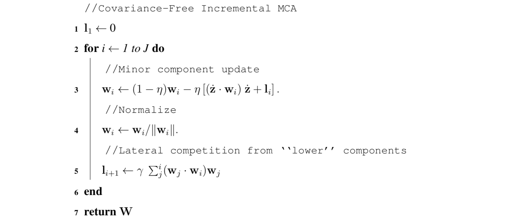
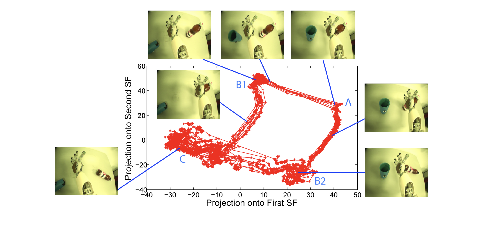

.. _icub:

iCub robot
==========
.. codesnippet::

Slow feature analysis (SFA) is an unsupervised learning technique that extracts features from an input stream with the objective of maintaining an informative but slowly-changing feature response over time. Due to some promising results so far, SFA has an intriguing potential for autonomous agents that learn upon raw visual streams, but in order to realize this potential it needs to be both hierarchical and adaptive. An incremental version of Slow Feature Analysis, called IncSFA, was recently introduced [1]_

.. contents:: **Table of contents**
   :local:

--------------

.. _Intuition behind IncSFA:

1. Intuition behind IncSFA
--------------------------

We first review SFA briefly in an intuitive sense. SFA [2]_ is a form of
unsupervised learning (UL). It searches for a set of mappings
:math:`g_i` from data :math:`x \in R^{I}` to output components
:math:`y_i = g_i(x)` that are separate from each other in some sense and
express information that is in some sense relevant. In SFA separateness
is realized as decorrelation (like in PCA), while relevance is defined
in terms of the slowness of change over time.

Given an :math:`I-dimensional` sequential input signal 
:math:`x(t) = [x_1(t), ..., x_I(t)]^T` , find a set of J instantaneous
real -valued functions :math:`g(x) = [g_1(x), ..., g_J(x)]^T`, which
together generate a J -dimensional output signal
:math:`y(t) = [y_1(t),...,y_J(t)]^T` with :math:`y_j(t) := g_j(x(t))`,
such that for each :math:`j \in {1,...,J}`

.. math:: \Delta_j := \Delta(y_j) := <\dot{y}_j^2> \text{is minimal}

under the constraints

.. math:: <y_j> = 0 \text{ (zero mean)} 
.. math:: <y_j^2> = 0 \text{ (unit variance)} 
.. math:: \forall i < j: \, <y_i y_j> = 0 \text{ (decorrelation and order)}

Solving this learning problem involves non-trivial variational calculus
optimization. But it is simplified through an eigenvector approach:

.. rubric:: Step 1:

If the :math:`g_j` are linear combinations of a finite set of nonlinear
functions h, then

.. math:: y_j(t) = g_j(x(t)) = w_j^T h(x(t)) = w_j^T z(t)

Hence, the SFA problem now becomes to find weight vectors :math:`w_j` to
minimize the rate of change of the output variables2 

.. math:: \Delta (y_j) = <\dot{y_j}^2> = w_j^T <\dot{z} \dot{z}^T> w_j

If the functions of h are chosen such that z has unit covariance matrix
and zero mean, the three constraints will be fulfilled if and only if
the weight vectors :math:`w_j` are orthonormal.

.. rubric:: Step 2:

To select h appropriately, a well-known process called whitening (or
sphering), is used to map x to a z with zero mean and identity
covariance matrix.Whitening requires the PCs of the input signal (PCA
#1).

.. rubric:: Step 3:

The orthonormal basis that minimizes the rate of output change are the
minor components – principal components with smallest eigenvalues – in
the derivative space. So another PCA (#2) on z yields the slow features
(eigenvectors) and their order (via eigenvalues).

|
|
	 

IncSFA also employs the eigenvector tactic, but may update an existing
estimate on any amount of new data, even a single data point
:math:`x(t)`. A high-level formulation is

.. math:: (\textbf{W}(t+1), \,  \theta(t+1)) = IncSFA (\textbf{W}(t), \, x(t), \, \theta(t))

where :math:`W = (w_1 , ..., w_J )` is the matrix of existing slow
feature vector estimates, and :math:`\theta` contains algorithm memory
and parameters, which we will discuss later.

To replace **PCA #1**, IncSFA needs to do online whitening of input x.
We use Candid Covariance-Free Incremental (CCI) PCA (Weng et al., 2003).
CCIPCA incrementally updates both the eigenvectors and eigenvalues
necessary for whitening, and does not keep an estimate of the covariance
matrix. CCIPCA is also used to reduce dimensionality.

Except for low-dimensional derivative signals z ̇, CCIPCA cannot replace
**PCA #2**. It will be unstable, since the slow features correspond to
the least significant components. Minor Components Analysis (MCA) (Oja,
1992) incrementally extracts the principal components with the smallest
eigenvalues. We use Peng’s low complexity updating rule (Peng et al.,
2007). Peng proved its convergence even for constant learning rates—good
for open-ended learning. MCA with sequential addition (Chen et al.,
2001; Peng and Yi, 2006) will extract multiple slow features in
parallel.

--------------

.. _IncSFA Algorithm:

2. IncSFA Algorithm
-------------------

In this chapter we will describe each step of appliying IncSFA method.
For clarity we will demonstrate these steps on high-dimensional video.

Here we present results obtained through a robot’s episodic interactions
with objects in its field of view. Two plastic cups are placed in the
iCub robot’s field of view. The robot performs motor babbling in one
joint using a movement paradigm of Franzius et al. During the course of
babbling, it happens to topple the cups, in one of two possible orders.
The episode ends a short time after it has knocked both down. A new
episode begins with the cups upright again and the arm in the beginning
position. A total of 50 separate episodes were used as training data.

|
|
	 

|
|

.. code:: ipython3

    import numpy as np
    import scipy.io
    from numpy import linalg as LA
    import matplotlib.pyplot as plt

|

.. rubric:: Quadratic extansion

The driving force cannot be extracted linearly, so a nonlinear expansion is used—temporal in this case.

|

.. code:: ipython3

    # quadratic expansion of input vector (a COLUMN vector)
    def quadexpand(input_vector):
        triang_matrix = np.triu(np.dot(input_vector, input_vector.T))
        quad_component = triang_matrix[np.nonzero(triang_matrix)].reshape(-1, 1)
        return np.vstack((input_vector, quad_component))

|
				
.. rubric:: Learning Rate Scheduling

Learning rate 1/t is only spatiotemporally optimal if every sample is drawn from the same distribution, which will not be the case for the
lower-order components, and in general for autonomous agents. I use an amnesic
averaging technique, where the influence of old samples on the current estimates
diminish over time. The three-sectioned amnesic averaging function μ is shown in
the algorithm. It uses three stages, defined by points :math:`t_1` and :math:`t_2`. In the first stage, the
learning rate is l . In the second, the learning rate is scaled by c to speed up learning t
of lower-order components. In the third, it changes with t, eventually converging to 1/r where r is an amnesic average constant.

|

.. code:: ipython3

    def amnesic(time, t1, t2, r, m):
        
        if (time < t1):
            U = 0
        elif (time >= t1 and time < t2):
            U = (r * (time-t1)) / (t2-t1) 
        else:
            U = r + ((time-t2) / m)
        
        w1 = (time-1-U) / time  
        w2 = (1+U) / time
    
        return (w1, w2)

.. rubric:: CCIPCA

CCIPCA updates estimates of eigenvalues and eigenvectors from each sample in order to implement incremental whitening. For inputs  :math:`u_i` , the first PC is the expectation of the normalized response-weighted inputs. The corresponding incremental updating equation:

.. math:: v_i (t) = (1 - \eta) v_i (t-1) + \eta \Bigg[ \frac{u_i (t) v_i (t-1)}{|| v_i (t-1) ||} u_i (t) \Bigg]

Any component i > 1 not only must satisfy the equation but must also be orthogonal to the higher-order components. The residual method generates observations in a complementary space so that lower-order eigenvectors can be found by the update rule

.. math:: u_{i+1} (t) = u_{i} (t) - \Bigg ( u_i^T (t) \frac{v_i}{|| v_i (t) ||} \Bigg) \frac{v_i(t)}{|| v_i (t) ||}

|
|

.. code:: ipython3

    def CCIPCA(V, time, input_vector, pp = [20, 200, 3, 2000], num_comp = None):
        
        # for optional arguments 
        #if pp == None: 
        #    pp = [20, 200, 3, 2000]
        #if num_comp == None:
        #    num_comp = V.shape[1]
        
        num_comp = V.shape[1]
        
        V = V.copy()
            
        # learning rate from amnesic average
        dummy, lr = amnesic(time, pp[0], pp[1], pp[2], pp[3])
    
        Xt = input_vector.reshape(-1,)
        Vn = np.zeros(V.shape)
        
        D = np.zeros((V.shape[1], V.shape[1]))
        
        Vnorm = []
        for i in range(num_comp):
            
            #print(i, V[:, i], V[:, i].shape)
    
            # update
            V[:, i] = (1-lr) * V[:, i] + lr * (np.dot(V[:, i], Xt)) / LA.norm(V[:, i]) * Xt
            # residual
            Xt = Xt - (np.dot(Xt, V[:, i])) / LA.norm(V[:, i]) * (V[:, i] / LA.norm(V[:, i]))
            Vnorm.append(LA.norm(V[:, i]))
            
        indices = sorted(range(len(Vnorm)), key=lambda k: Vnorm[k], reverse = True)
    
        V = V[:, indices]
        
        for i in range(num_comp):
            # normalized 
            Vn[:, i] = V[:, i] / LA.norm(V[:, i])
            
            # diagonal matrix
            D[i, i] = 1 /  np.sqrt(LA.norm(V[:, i]))
        
        # compute whitening matrix
        S = np.dot(Vn, D)
        
        return (V, S, D, Vn)
				

.. rubric:: Covariance-Free Incremental Minor Component Analysis

After using CCIPCA components to generate an approximately whitened signal z, the derivative is approximated by :math:`\dot{z} (t) = z(t) - z(t-1)`. In this derivative space, the minor components on :math:`\dot{z}` are the slow features. To find the minor component, Peng’s MCA is used. For “lower-order” minor components, the sequential addition technique shifts each observation into a space where the minor component of the current space will be the first PC, and all other PCs are reduced in order by one. Sequential addition allows IncSFA to extract more than one slow feature in parallel.

        

.. code:: ipython3

    def CIMCA(W, lr, gamma, input_vector):
        
        W = W.copy()
        input_vector = input_vector.reshape(-1,1)
        w0 = W[:,0].reshape(-1,1)
        C1 = np.dot(np.dot(input_vector, w0.T), input_vector)
        W[:,0] =  (1-lr) * W[:,0] - lr * C1.reshape(-1,)
        W[:,0] = W[:,0] / LA.norm(W[:,0]);
        
        for i in range(1, W.shape[1]):
            
            L = W[:,0] * 0
            
            for j in range(i):
                w1_j = W[:,j].reshape(-1, 1)
                w1_i = W[:,i].reshape(-1, 1)
                L = L + (np.dot(np.dot(w1_j, w1_i.T), w1_j)).reshape(-1,)
        
            w2 = W[:,i].reshape(-1,1)
            C = np.dot(np.dot(input_vector, w2.T), input_vector)
            W[:,i] =  (1.0-lr) * W[:,i] - lr * (C.reshape(-1,) + gamma * L)
            W[:,i] = W[:,i] / LA.norm(W[:,i])
            
        return W
				
|
|

.. code:: ipython3

    # will update plots during training, otherwise, it just shows the result at the end
    incremental_viz = True
    
    num_sf = 3                  # number of slow features to compute
    
    dim_reduced = 40           # CCIPCA output dimension
    mca_lr = 0.0005            # MCA learning rate
    pp = np.array([20, 200, 2, 10000])      # amnesic averaging plasticity parms
    
    max_num_episodes = 200      # number of episodes to train over

    data = scipy.io.loadmat('robotdata.mat')
    DATA = data['DATA']/255
    EP_LEN = data['EP_LEN'][0]
    EP_START_POS = data['EP_START_POS'][0]

    # number of episodes (should be 50)
    num_episodes = len(EP_LEN)
    
    # episodes for testing
    test_eps = [0, 1, 2]
    
    # their length
    test_ep_len = EP_LEN[test_eps]
    
    # how many
    num_test_eps = len(test_ep_len)
    
      
    # initialize
    eps = np.finfo(float).eps
    
    curr_list = np.random.randint(1, 50, max_num_episodes)
    
    #matrix of principal components to learn (initialized to the data)
    V = DATA[:, :dim_reduced].copy()
    # matrix of slow features (initialized random)
    W = np.random.randn(dim_reduced, num_sf)
    W_normed = W / W.max(axis=0)
    
    # mean estimate
    x_mean = (DATA[:,0] + eps).reshape(-1,1)
    
    # mean in derivative space
    x_derv_mean = np.zeros((dim_reduced, 1))
    # first principal component in derv. space (for sequential addition parameter)
    Vsup = np.zeros((dim_reduced, 1)) + eps
    
    # slowness measure over test episodes
    slowness = np.zeros((num_sf, num_test_eps))
    
    #feature correlation measure
    # fcorr = np.zeros((1, max_num_episodes))
    
    
    #iterator for number of training samples
    cnt = 2
    # storage of slowness measurement after each episode trains
    
    y = dict()
    
    print('\nTraining begins!');

|		

We conduct an experiment with real high-dimensional vision sequences generated from the camera-eyes of an exploring iCub humanoid robot. Two plastic cups are placed in the iCub robot’s field of view. The robot performs motor babbling in one joint of its right arm. During the course of babbling, it happens to topple both cups in one of two possible orders. The episode ends a few frames after it has knocked both down. A new episode begins with the cups upright again and the arm in the beginning position. A total of 50 separate episodes were recorded and the images used as training data. IncSFA updates from each 80 × 60 (grayscale) image. Only the 20 most significant principal components are computed by CCIPCA, using learning rate parameters :math:`t_1 = 20, t_2 = 200, c = 2, r = 10000`. Only the first 5 slow features are computed via CIMCA with learning rate 0.001. The MCA vectors are normalized after each update during the first 10 episodes, but not thereafter (for faster convergence). The algorithm runs for 400 randomly-selected (of the 50 possible) episodes. The experiment is replicated 25 times.

|

.. code:: ipython3
    
    # training over MAX_NUM_EPISODE randomly selected episodes
    for episode in range(max_num_episodes):
        #print('W = \n', W[:5, :5])
        # random selection of an episode
        curr_eps = curr_list[episode] - 1
        #curr_eps = np.random.randint(50)           
        ep_start = EP_START_POS[curr_eps]  
        ep_end = EP_START_POS[curr_eps+1] - 1
    
        for i in range(EP_LEN[curr_eps]):
            # get data point
            actual_index = EP_START_POS[curr_eps] + i -1
            datum = DATA[:, actual_index].copy()
            x = datum.reshape(-1, 1)
            
            # update mean
    
            dummy, lr = amnesic(cnt, pp[0], pp[1], pp[2], pp[3])
            
            # update mean estimate
            x_mean = (1 - lr) * x_mean + lr * x      
            input_zeroed = x - x_mean     
            
    
            # CCIPCA
            V, S, D, Vn = CCIPCA(V, cnt+1, input_zeroed, pp)
    
            #print(S[:3, :3])
            # whiten
            if (i > 0):
                x_prev = x_white;
    
            x_white = np.dot(S.T, input_zeroed)
            
    
            # compute derivative signal(ONLY if it is not a new episode)
            if (i > 0):
                
                x_derv = x_white - x_prev  # b.diff approx derivative
    
                x_derv_mean = (1-lr) * x_derv_mean + lr * x_derv  # update mean
    
                x_derv_no_mean = x_derv - x_derv_mean   # subtract mean
                
                # a single pca for the first eval 
                Vsup, dummy1, dummy2, dummy3 = CCIPCA(Vsup, cnt+1, x_derv_no_mean, pp)
                
                # MCA
    
                
                W = CIMCA(W, mca_lr, LA.norm(Vsup), x_derv_no_mean)     
                
            cnt = cnt + 1
            
       # print('LR =', lr)
        if (incremental_viz):
            # to visualize features and measure slowness
            for j in range(num_test_eps):  # for each testing episode
                y[j] = np.zeros((test_ep_len[j], num_sf))
                
                for k in range(test_ep_len[j]):              # for each datum within the episode
                    test_cnt = EP_START_POS[test_eps[j]] + k - 1
                    
                    #print(test_cnt)
                    datum = DATA[:,test_cnt].copy()
                    X = datum.reshape(-1,1) - x_mean            # subtract mean
                    
                    #print('DATA=', DATA[:5,test_cnt])                
                    x_white = np.dot(S.T, X)                 # whiten
                    
    
                    
                    # slow feature output
                    for m in range(num_sf):
                        y[j][k,m]= np.dot(W[:,m], x_white)
                        
            for j in range(num_test_eps):
                # post-processing of the output signals
                #y(j).sig = y(j).sig - repmat(mean(y(j).sig),size(y(j).sig,1),1) # subtract mean
                
                #print('y_j = ', y[j][:3, :])
                y[j] = y[j] - np.mean(y[j], axis=0)
                
                #print('y_j = ', y[j][:3, :])
                y[j] = y[j] / np.max(np.abs(y[j]), axis=0)
                
                
                for k in range(num_sf):
                    slowness[k,j] = np.mean(np.abs(y[j][1:,k] - y[j][:-1,k]), axis=0)
            
            
            slw_per_feat = np.mean(slowness, axis=1)
            
            #print('slw_per = ', slw_per_feat)
            # re-order by slowness (optional but seems to be helpful)
            
            Wtemp = W
                    
            order = np.argsort(slw_per_feat)
            
            
            W = Wtemp[:,order]
    
            #for j in range(num_sf):
            #    print(Wtemp[:5,order[j]])
            #   W[:,j] = Wtemp[:,order[j]]
            
            #slw_per_feat = slw_per_feat[order]
            
            if (episode % 5 == 0):
                y_test_big = dict()
                for j in range(6, 26):
                    y_test_big[j] = np.zeros((EP_LEN[j], num_sf))
                    for k in range(EP_LEN[j]):
                        test_cnt = EP_START_POS[j] + k - 1
                        
                        datum = DATA[:,test_cnt].copy()
                        X = datum.reshape(-1,1) - x_mean            # subtract mean
                    
                        #print('DATA=', DATA[:5,test_cnt])                
                        x_white = np.dot(S.T, X)                 # whiten
                        
                        # slow feature output
                        for m in range(num_sf):
                            y_test_big[j][k,m]= np.dot(W[:,m], x_white)
                
                for j in range(6, 26):
                    plt.plot(y_test_big[j][:,0], y_test_big[j][:,1], 'r-*')
                    
                plt.show()

|

	
|

After training completes, the images are embedded in a lower dimension using the learned features. The embedding of trajectories of 20 different episodes are shown with respect to the first two PCs as well as the first two slow features. Since the cups being toppled or upright are the slow events in the scene, IncSFA’s encoding is keyed on the object’s state (toppled or upright). PCA does not find such an encoding, being much more sensitive to the arm. Such clear object-specific low-dimensional encoding, invariant to the robot’s arm position, is useful, greatly facilitating training of a subsequent regressor or reinforcement learner.

--------------

References
------------

.. [1] Kompella V. R., Luciw M., Schmidhuber J. (2011) `Incremental slow feature analysis: Adaptive and episodic learning from high-dimensional input streams <https://arxiv.org/pdf/1112.2113.pdf>`__

.. [2] Wiskott and Sejnowski (2002) `Slow Feature Analysis: Unsupervised Learning of Invariances <https://www.mitpressjournals.org/doi/10.1162/089976602317318938>`__

