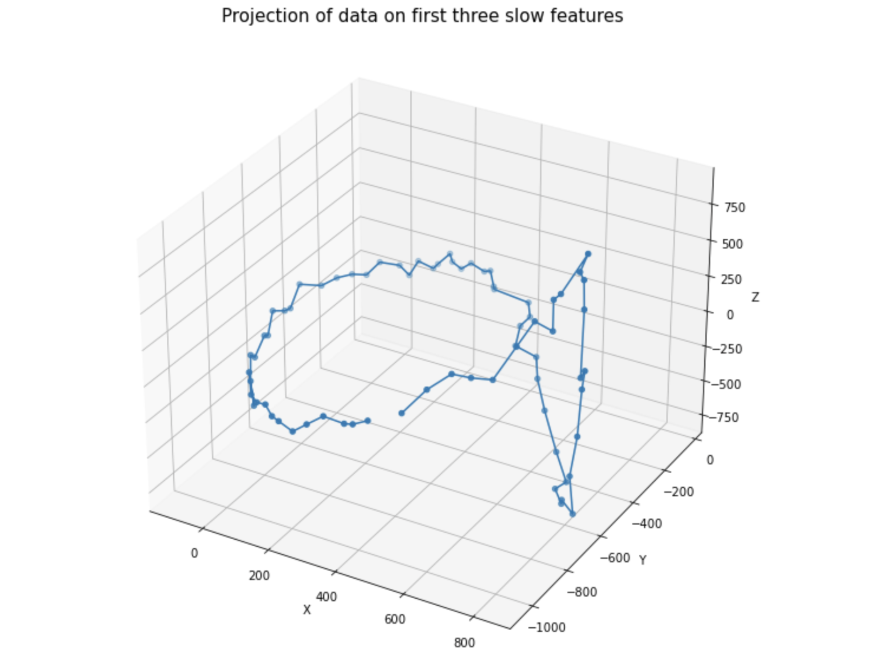
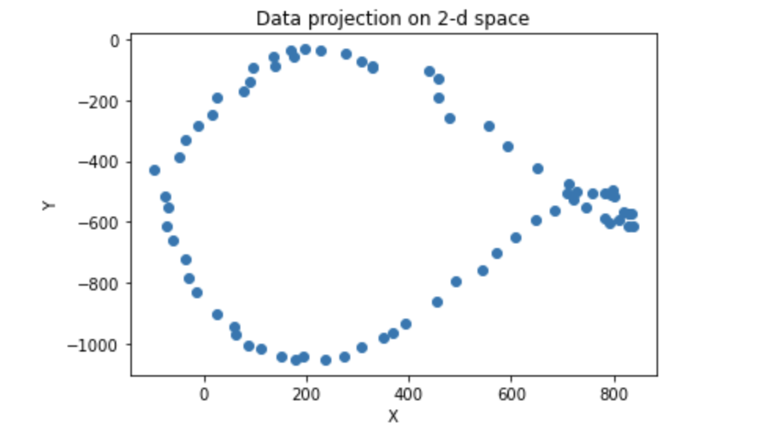

.. _incsfa:

Image Processing with Incremental Slow Feature Analysis (IncSFA)
================================================================
.. codesnippet::

-  Incremental version of SFA

-  Unsupervised preprocessor for autonomous learning agents and robots

-  Combines incremental Principal Components Analysis (PCA) and Minor
   Components Analysis (MCA)

Slow feature analysis (SFA) is an unsupervised learning technique that
**extracts features from an input stream with the objective of maintaining
an informative but slowly-changing feature response over time.** There are
limitations to existing SFA implementations due to their batch processing
nature, which becomes especially apparent when attempting to apply it in
somewhat uncontrolled environments. Incremental Slow Feature Analysis
(IncSFA) [1]_ has several advantages over SFA:

1. **Adaption to changing input statistics**

SFA requires all data to be collected in advance. New data cannot be
used to modify already learned slow features. Once the input statistics
change, IncSFA can automatically adapt its features without external
intervention, while SFA has to discard previous features to process the
new data.

2. **Reduced sensitivity to outliers**

Real-world environments typically exhibit infrequent, uncontrolled,
insignificant external events that should be ignored. SFA is very
sensitive to such events, encoding everything that changes slowly within
the current batch. IncSFA’s plasticity, however, makes it lose
sensitivity to such events over time.

3. **Covariance free**

SFA techniques rely upon Principal Component Analysis, which requires
the data’s covariance matrix. Estimating, storing, and/or updating
covariance matrices can be expensive for high-dimensional data and
impractical for open-ended learning. IncSFA uses covariance-free
techniques. 

.. contents:: **Table of contents**
   :local:

--------------
	 
.. _Signal processing with the IncSFA:

1. Signal processing with the IncSFA 
------------------------------------

To show that IncSFA derives the same features as SFA, we begin with a
simple problem that was introduced in the original SFA paper [2]_.

The input signal is:

.. math::

    x_1(t) = sin(t) + [cos(11t)]^2, \\
    x_2(t) = cos(11t), t\in[0, 2 \pi] 

Both components vary quickly over time. The two slowest features hidden in the
signal are

.. math:: y_1(t) = x_1(t) * x_2(t) = sin(t)

.. math:: y_2(t) = [x_2(t)]^2 = [cos(11t)]^2

First, let’s import the usual data processing modules and the library
`mdp <https://mdp-toolkit.github.io>`__, which includes an IncSFA implementation.

.. code:: ipython3

    %matplotlib inline
    import matplotlib.pyplot as plt
    
    import random 
    import numpy as np
    import time
    
    import mdp

Implementations of SFA usually perform linear feature extraction based on
a non-linear data expansion in a preprocessing step.
Indeed, we can see from our example that *the slowest components are
highly non-linear!* We remedy this by applying a polynomial data expansion
of second degree to the time series first. On top of this, a linear SFA
implementation can extract features non-linearly from the original data.

.. code:: ipython3

    t = np.linspace(0, 4 * np.pi, 500)
    x1 = np.sin(t) + np.power(np.cos(11 * t), 2)
    x2 = np.cos(11 * t)
    # each row corresponds to components of the input signal
    x = np.zeros([t.shape[0], 2])
    x[:, 0] = x1
    x[:, 1] = x2
    # initialize and apply mdp node responsible for quadratic expension
    expnode = mdp.nodes.PolynomialExpansionNode(2)
    input_data = expnode(x)

Next, we train an IncSFA model on the derived transformed input signal
on 500 data points with 10 passes through (epochs) through the data.  

We choose the output dimension parameter to extract only the first two
slowest features. Later we will compare them to the output of ordinary SFA.

.. code:: ipython3

    output_dim = 2
    # create IncSFA node instance
    IncSFA_node = mdp.nodes.IncSFANode(output_dim=output_dim, eps = 0.08)
    
    # compute 2 slowest features based on training data
    for i in range(10):
        IncSFA_node.train(input_data)
    IncSFA_node.stop_training()
    # get weight vectors of the model, i.e. slow features 
    IncSFA_wv = IncSFA_node.sf
    # projection of training data to the low-dimensional feature space 
    IncSFA_proj = IncSFA_node.execute(input_data)

We train ordinary SFA on the same data and compare its output with the
result from IncSFA.

.. code:: ipython3

    SFA_node = mdp.nodes.SFANode(output_dim=output_dim)
    SFA_node.train(input_data)
    SFA_node.stop_training()
    SFA_wv = SFA_node.sf
    SFA_proj = SFA_node.execute(input_data)

We want to check whether both methods derive the same result and – if not – examine the difference.

.. code:: ipython3

    import matplotlib
    matplotlib.axes.Axes.plot
    matplotlib.pyplot.plot
    matplotlib.axes.Axes.legend
    matplotlib.pyplot.legend
    
    
    f = plt.figure(figsize=(30,10))
    ax = f.add_subplot(121)
    ax2 = f.add_subplot(122)
    
    ax.plot(SFA_proj[:,0], 'r')
    ax.plot(SFA_proj[:,1], 'b')
    ax.set_title('SFA output of the first two slow features', fontdict = {'fontsize':22})
    
    ax2.plot(IncSFA_proj[:,0], 'r', label='First slow feature')
    ax2.plot(IncSFA_proj[:,1], 'b', label='Second slow feature')
    ax2.set_title('IncSFA output of the first two slow features', fontdict = {'fontsize':22})
    
    f.legend(loc='upper center', fontsize = 20)

|
|

.. image:: graph_1.png
				:width: 700
				:height: 300

To measure the difference between the estimated features :math:`w(t)` of IncSFA and the
features :math:`w(t)^*` of ordinary SFA we use the cosine similarity

.. math:: Cosinesimilarity(t) = \frac{|w^T(t) * w^*|}{||w^T(t)|| * ||w^*||}

The cosine similarity equals one when the directions align (the feature
is correct) and zero when they are orthogonal.

.. code:: ipython3

    dcosines = np.zeros([len(SFA_wv),output_dim])
    
    for i in range(len(IncSFA_wv)):
        for dim in range(output_dim):
            dcosines[i, dim] = np.abs(np.dot(IncSFA_wv[i][:], SFA_wv[i][:]))/ \
            (np.linalg.norm(IncSFA_wv[i][:])*np.linalg.norm(SFA_wv[i][:]))
            
            
    print ('Success status: ', np.allclose(dcosines[-1], 
		... np.ones(output_dim), atol=1e-2))
		
    >>>> Success status:  True
		
    print ('Maximum error: ', np.max(np.abs(np.ones(output_dim)-dcosines[-1])))
		
    >>>> Maximum error:  9.035924059319633e-06

|
|

.. rubric:: This result shows that it is indeed possible to extract multiple slow features in an online way without storing covariance matrices.

--------------

.. _High-Dimensional Video with Linear IncSFA:

2. High-Dimensional Video with Linear IncSFA 
--------------------------------------------

InSFA makes it possible to use SFA in high-dimensional video processing
applications without using deep receptive field based networks. CCIPCA
provides an intermediate dimensionality reduction, which can greatly
reduce the complexities in computation and memory space as well as the
search space for slow features via MCA.

As an experiment to demonstrate this, SFs are extracted from a rotating
vision-based agent in a square-shaped room. The room has four
complexly-textured walls.

.. figure:: room.gif

For this example, one of the
`PASSTA datasets <https://www.cvl.isy.liu.se/research/datasets/passta/>`__
is used. The images are assumed to have been taken from a camera mounted on
a tripod. Between each pair of subsequent images, the camera is assumed to
have been rotated around the vertical axis through the optical center.

.. code:: ipython3

    from PIL import Image
    import glob

**Lunch Room Blue:** *consists of 72 images acquired with a Canon DS50 and
perspective lenses with a resolution of 1280x1920 px at poor light
conditions. A panorama head was used to approximate a fixed rotation of 5
degrees around the vertical axis about the optical center of the camera.*

We rescale the images to 50 x 70 x 3 components (pixels and color channels)
to make the training less time-consuming.

.. code:: ipython3

    filenames = sorted(glob.glob('./LunchRoom/LunchRoom/*.jpg'))
    images = [Image.open(fn).resize((50, 70), Image.ANTIALIAS) for fn in filenames]
    data = np.vstack([np.array(im).reshape(1, -1) for im in images])
		
At any time, a slight amount of Gaussian noise is added to the image
(:math:`\sigma = 8`). The agent has a video input sensor, and the
sequence of image frames with 10500 (50  * 70 * 3) dimensions is fed into a linear
IncSFA directly.

.. code:: ipython3

    noisy_data = np.empty(data.shape)
    for i in range (data.shape[0]):
        gauss = np.random.normal(0, 8, data.shape[1])
        noisy_data[i, :] = data[i, :] + gauss
		
    # we normalize pixel values, i.e. transform values from [0, 255] -> [0, 1]
    noisy_data = (noisy_data - noisy_data.min())/(noisy_data.max() - noisy_data.min())

To reduce computation time, only the 40 most significant principal components are computed by
CCIPCA.  Computation of the covariance matrix and its full eigendecomposition (including over 5000 eigenvectors and eigenvalues) is
avoided. On the 40 × 40 whitened difference space, only the first 5 slow features are computed via MCA
and sequential addition. Here we consider 500 passes (epochs) through the data each time adding a new image to the observation to imitate real-world situation.

.. code:: ipython3

    node = mdp.nodes.IncSFANode(whitening_output_dim=40, output_dim=3)
    
    for i in range(500):
        node.train(noisy_data)
    node.stop_training()
    
    out = node.execute(data)
		

The result of projecting the (noise-free) data onto the first three slow features is given below.
A single linear IncSFA has incrementally compressed this high-dimensional noisy sequence to a nearly
unambiguous compact form, learning to ignore the details at the pixel level and attend to the true cyclical
nature underlying the image sequence. 

.. code:: ipython3

    # importing mplot3d toolkits, numpy and matplotlib 
    from mpl_toolkits import mplot3d 
    import numpy as np 
    import matplotlib.pyplot as plt 
      
    fig = plt.figure(figsize = (10, 10)) 
      
    # syntax for 3-D projection 
    ax = plt.axes(projection ='3d') 
      
    
    # Creating dataset
    z = out[:,0]
    x = out[:,1]
    y = out[:,2]
    
    ax.set_xlabel('x')
    ax.set_ylabel('y')
    ax.set_zlabel('z')
         
    ax.scatter3D(x, y, z, 'green') 
    ax.plot3D(x,y,z)
    ax.set_title('Projection of data on first three slow features') 
        
    plt.show() 

The same data projected on two slow features will show the cyclical structure more clearly.

				

				
A few subsequences have somewhat ambiguous encodings, because certain images associated with slightly different angles are very similar.

References
----------

.. [1] Kompella V. R., Luciw M., Schmidhuber J. (2011) `Incremental slow feature analysis: Adaptive and episodic learning from high-dimensional input streams <https://arxiv.org/pdf/1112.2113.pdf>`__

.. [2] Wiskott and Sejnowski (2002) `Slow Feature Analysis: Unsupervised Learning of Invariances <https://www.mitpressjournals.org/doi/10.1162/089976602317318938>`__

