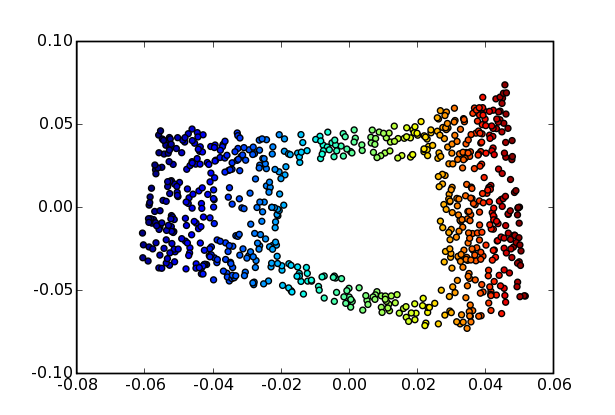

.. _lle:

Locally Linear Embedding
========================
.. codesnippet::

Locally linear embedding (LLE) approximates the input data with a
low-dimensional surface and reduces its dimensionality by learning
a mapping to the surface. Here we consider data generated randomly
on an S-shaped 2D surface embedded in a 3D space:

.. image:: s_shape_3D.png
        :width: 500
        :alt: S-shaped surface

The surface is defined by the function

    >>> def s_distr(npoints, hole=False):
    ...     """Return a 3D S-shaped surface. If hole is True, the surface has
    ...     a hole in the middle."""
    ...     t = mdp.numx_rand.random(npoints)
    ...     y = mdp.numx_rand.random(npoints)*5.
    ...     theta = 3.*mdp.numx.pi*(t-0.5)
    ...     x = mdp.numx.sin(theta)
    ...     z = mdp.numx.sign(theta)*(mdp.numx.cos(theta) - 1.)
    ...     if hole:
    ...         indices = mdp.numx.where(((0.3>t) | (0.7<t)) | ((1.>y) | (4.<y)))
    ...         return x[indices], y[indices], z[indices], t[indices]
    ...     else:
    ...         return x, y, z, t
    
We generate 1000 points on this surface, then define an LLENode with
parameters k=15 (number of neighbors) and output_dim=2 (the number of
dimensions of the reduced representation), then train and execute the
node to obtain the projected data:

    >>> n, k = 1000, 15
    >>> x, y, z, t = s_distr(n, hole=False)
    >>> data = mdp.numx.array([x,y,z]).T
    >>> lle_projected_data = mdp.nodes.LLENode(k, output_dim=2)(data)

The projected data forms a nice parametric representation of the
S-shaped surface:

.. image:: s_shape_lle_proj.png
        :width: 500
        :alt: LLE projection of the S-shaped surface

The problem becomes more difficult if the surface has a hole in the
middle:

.. image:: s_shape_hole_3D.png
        :width: 500
        :alt: S-shaped surface with hole

In this case, the LLE algorithm has some difficulty finding the
correct representation. The lines

    >>> x, y, z, t = s_distr(n, hole=True)
    >>> data = mdp.numx.array([x,y,z]).T
    >>> lle_projected_data = mdp.nodes.LLENode(k, output_dim=2)(data)

return a distorted mapping:

The Hessian LLE Node takes the local curvature of the surface into
account, and is able to find a better representation:

    >>> hlle_projected_data = mdp.nodes.HLLENode(k, output_dim=2)(data)

.. image:: s_shape_hole_hlle_proj.png
        :width: 500
        :alt: HLLE projection of the S-shaped surface with hole
