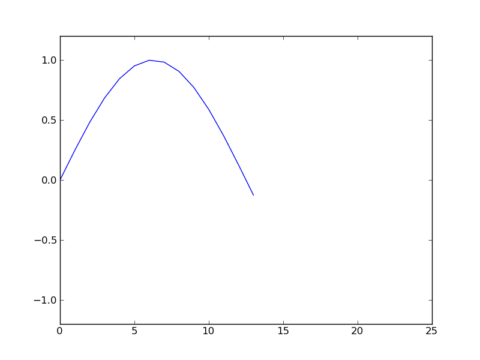

.. _slideshow:

=========
Slideshow
=========

Download :download:`slideshow.py`.

.. literalinclude:: slideshow.py

.. image:: ../../_static/examples/slideshow-animation/img0002.png
   :width: 200px

.. image:: ../../_static/examples/slideshow-animation/img0019.png
   :width: 200px

.. raw:: html

   

     Live
     <a href="../../_static/examples/slideshow-animation/animation.html">Demo</a>
     is available.
   

.. _slideshow_double:

================
Double slideshow
================

Download :download:`slideshow_double.py`.

.. literalinclude:: slideshow_double.py
