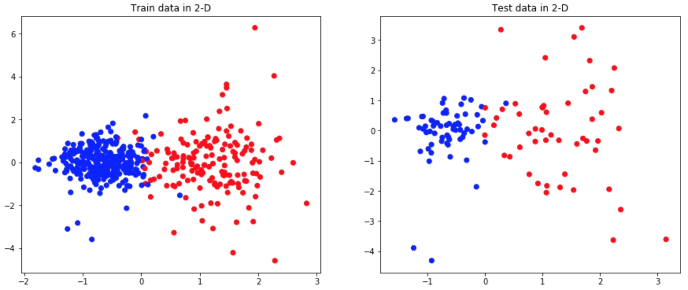
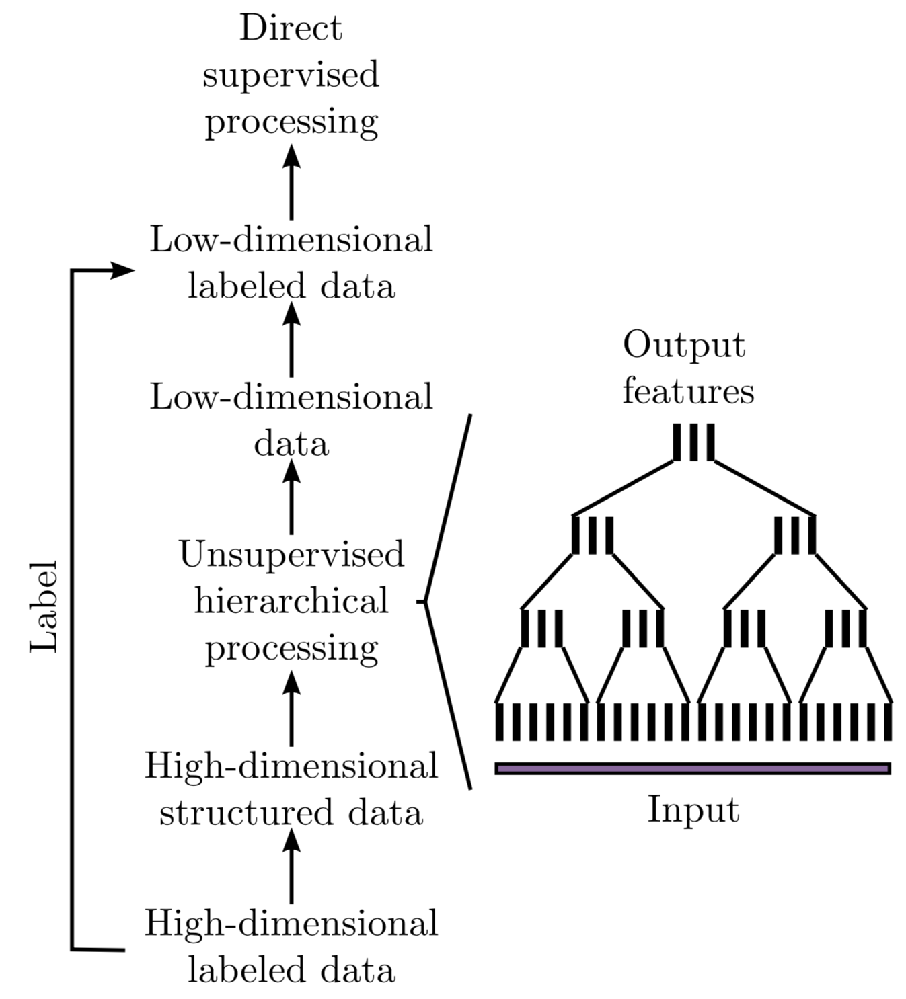
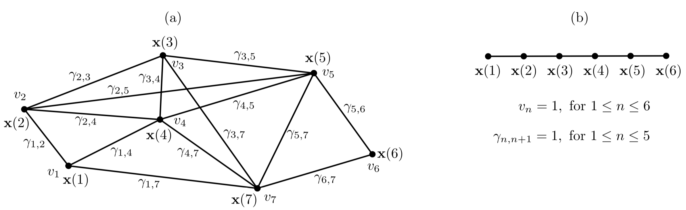

.. _gsfa:

======================
Graph-Based SFA (GSFA)
======================

-  Extension of slow feature analysis
   `(SFA) <https://www.ini.rub.de/research/blog/a_brief_introduction_to_slow_feature_analysis/>`__

-  Supervised dimensionality reduction method

-  Trained with a graph, in which the vertices are the samples and the
   edges represent similarities of the corresponding labels.

Graph-based slow feature analysis (GSFA) is a supervised extension of
SFA algorithm that relies on particular graphs structure to extract
features that preserve label similarities. More precisely, the algorithm
utilize training graphs, in which the verticies are the samples and the
edges represent similarities of the corresponding labels. Later, we use
aquired low-dimensional representaion of the original data to train
typical supervised learning algortihms.

In this tutorial we will briefly exlpain the idea behind GSFA and
specify the optimization task it solves. Moreover, we will show the
effeciency of the GSFA compared to SVM on a toy example and introduce an
approach that makes classsification task more interpretable.

Table of Contents
-----------------

1. `Classification using GSFA`_

2. `Idea behind GSFA`_

3. `How the graphs are used for the training`_

4. `GSFA Optimization Problem`_

5. `Linear GSFA Algorithm`_

--------------

.. _Classification using GSFA:

1. Classification using GSFA 
----------------------------

To show the benefits of the model and its efficiency we will solve the
classification task that is based on
`‘breast_cancer’ <https://scikit-learn.org/stable/modules/generated/sklearn.datasets.load_breast_cancer.html>`__
dataset of sklearn library. More precisely, we will use SVM Classifier
as a baseline method and later see the effect of preprocessing data via
GSFA.

The breast cancer dataset is a classic and very easy binary
classification dataset. Features are computed from a digitized image of
a fine needle aspirate (FNA) of a breast mass. They describe
characteristics of the cell nuclei present in the image. It can be found
on `UCI Machine Learning
Repository <https://archive.ics.uci.edu/ml/datasets/Breast+Cancer+Wisconsin+%28Diagnostic%29>`__

**Number of instances:** 569

**Number of attributes:** 30 numeric, predictive attributes and the
class

**Attribute information:**

-  radius (mean of distances from center to points on the perimeter)
-  texture (standard deviation of gray-scale values)
-  perimeter
-  area
-  smoothness (local variation in radius lengths)
-  compactness (perimeter^2 / area - 1.0)
-  concavity (severity of concave portions of the contour)
-  concave points (number of concave portions of the contour)
-  symmetry
-  fractal dimension (“coastline approximation” - 1)

*The mean, standard error, and “worst” or largest (mean of the three
worst/largest values) of these features were computed for each image,
resulting in 30 features. For instance, field 0 is Mean Radius, field 10
is Radius SE, field 20 is Worst Radius.*

**Class:**

- WDBC-Malignant
- WDBC-Benign

First let’s import the usual data science modules and library
`mdp <https://mdp-toolkit.github.io>`__. We use it for GSFA
implementation and other data processing tools.

	>>> import matplotlib.pyplot as plt
	>>> from sklearn import (datasets, model_selection, metrics)
	>>> import numpy as np
	>>> import mdp 
	>>> from sklearn.svm import SVC

Now from the sklearn let’s load the ‘breast_cancer’ dataset. We’ll use
20% of the data for testing.

	>>> data, label = datasets.load_breast_cancer(return_X_y=True
	>>> data_train, data_test, label_train, label_test = \
	... model_selection.train_test_split(data, label, test_size=0.2)

We get the baseline classification quality.

	>>> clf = SVC(gamma='auto')
	>>> clf.fit(data_train, label_train)
	>>> SVM_test = clf.predict(data_train)
	>>> print("SVM test score: ", metrics.accuracy_score(label_train, SVM_test))

**SVM train score:  1.0**

	>>> clf = SVC(gamma='auto')
	>>> clf.fit(data_train, label_train)
	>>> SVM_test = clf.predict(data_test)
	>>> print("SVM test score: ", metrics.accuracy_score(label_test, SVM_test))

**SVM test score:  0.5614**

Let’s train GSFA model on training data, so that it will compute the
slowest features possible according to the GSFA optimization problem.
Since the label information is encoded in the graph connectivity, the
low-dimensional data are highly predictive of the labels.

We assign the parameter that is responsible for output dimension to 2.
This will let us to represent the original data in 2D coordinates.

	>>> output_dim = 2
	>>> GSFA_n = mdp.nodes.GSFANode(output_dim=output_dim)
	>>> GSFA_n.train(data_train, train_mode=("classification", label_train, 1))
	>>> GSFA_n.stop_training()
	
Then we find projections of the train and test data on feature space we have found.
    
	>>> GSFA_train = GSFA_n.execute(data_train)
	>>> GSFA_test = GSFA_n.execute(data_test)

Since we consider dimensionality reduction to the value of 2 we can
try to depict train and test data on 2-D graph.

	>>> import matplotlib
	>>> colors = ['red', 'blue']
	>>> f = plt.figure(figsize=(15,6))
	>>> ax = f.add_subplot(121)
	>>> ax2 = f.add_subplot(122)
	>>> ax.scatter(GSFA_train[:, 0], GSFA_train[:, 1], c=label_train,
	...	cmap=matplotlib.colors.ListedColormap(colors))
	>>> ax2.scatter(GSFA_test[:, 0], GSFA_test[:, 1], c=label_test,
	...	cmap=matplotlib.colors.ListedColormap(colors))
	>>> ax.set_title("Train data in 2-D")
	>>> ax2.set_title("Test data in 2-D")

**As we can see the GSFA shows good performance in finding features the
separate data even in two-dimensional representation.**

We train SVM on the data transformed with GSFA

	>>> GSFA_clf = SVC(gamma='auto')
	>>> GSFA_clf.fit(GSFA_train, label_train)
	>>> GSFA_SVM_test = GSFA_clf.predict(GSFA_test)
	>>> print("SVM test score: ", metrics.accuracy_score(label_test, GSFA_SVM_test))

 **GSFA dimension reduction + SVM score:  0.9649**

*Algorithms comparison*: 

+------------+-------------+------------+---------------+
| classifier | train_score | test_score | training_time |
+============+=============+============+===============+
| SVM        | 1.0         | 0.614      | 0.024         |
+------------+-------------+------------+---------------+
| GSFA + SVM | 1.0         | 0.991      | 0.057         |
+------------+-------------+------------+---------------+

--------------

.. _Idea behind GSFA:

2. Idea behind GSFA 
-------------------

Given a large number of high-dimensional labeled samples, supervised
learning algorithms can often not be applied due to prohibitive
computational requirements. In such cases, the following general scheme
based on hierarchical GSFA is proposed:

1\. Transform the labeled data to structured data, where the label information behind is implicitly encoded in the connections between the data points (samples).This permits using unsupervised learning algorithms, such as SFA, or its extension GSFA.

2\. Use hierarchical processing to reduce the dimensionality, resulting in low-dimensional data with component similarities strongly dependent on the graph connectivity. Since the label information is encoded in the graph connectivity, the low-dimensional data is highly predictive of the labels.

3\. Convert the (low-dimensional) data back to labeled data by combining the low-dimensional data points with the original labels or classes. This now constitutes a dataset suitable for standard supervised learning methods, because the dimensionality has become manageable.

4\. Use standard supervised learning methods on the low-dimensional labeled data to estimate the labels. The unsupervised hierarchical network plus the supervised direct method together constitute the classifier or regression architecture.

In the case of GSFA, the structured training data is called training
graph, a weighted graph that has vertices representing the samples,
vertex weights specifying a priori sample probabilities, and edge
weights indicating desired output similarities, as derived from the
labels.

--------------

.. _How the graphs are used for the training:

3. How the graphs are used for the training 
-------------------------------------------

The training data is represented as a training graph
:math:`G = (\textbf{V}, \textbf{E})` *(as illustrated in Figure bellow)*
s.t. :

-  :math:`\textbf{V}` corresponds to set of :math:`\textbf{x}(n)`
   :math:`\rightarrow` *each vertex of the graph is a sample*

-  Each edge of :math:`\textbf{E}` corresponds to a pair of samples
   :math:`(\textbf{x}(n), \textbf{x}(n'))`

Weights:
^^^^^^^^

1\. Edge weights indicate the **similarity between the connected vertices**. And since edges are undirected and have symmetric weights:

   .. math:: \gamma_{n, n'} = \gamma_{n', n}

2\. Each vertex  :math:`\textbf{x(}n\textbf{)}` has an associated weight :math:`v_n > 0`, which can be used to reflect its importance, frequency, or reliability.

For instance, a sample occurring frequently in an observed phenomenon
should have a larger weight than a rare sample. This representation
includes the standard time series as a special case in which the graph
has a linear structure and all node and edge weights are identical *(as
illustrated in Figure(b))*.

--------------

.. _GSFA Optimization Problem:

4. GSFA optimization problem 
----------------------------

The GSFA optimization problem over :math:`N` training samples can be
stated as follows.

-  **Given**: :math:`I` - dimensional input
   :math:`\textbf{x}(n) = (x_1(n), ..., x_I(n))^T` signal, where
   :math:`1 \leq n \leq N`

-  **Find**: vectorial function
   :math:`\textbf{g}: \mathbb{R}^{I} \rightarrow \mathbb{R}^{J}` within
   a function space :math:`\mathcal{F}` s.t. for each component of the
   output signal :math:`\textbf{y}(n) := \textbf{g}(\textbf{x}(n))` (
   i.e. each :math:`y_j(n)` for :math:`1 \leq j \leq J)` the objective
   function

.. math:: \Delta_j := \frac{1}{R} \sum_{n, n'} \gamma_{n, n'} (y_j(n') - y_j(n))^2 \text{ is minimal } \textbf{(weighted delta value)}

under the constraints

.. math:: \frac{1}{Q} \sum_{n} v_n y_j(n) = 0 \textbf{ (weighted zero mean) }

.. math:: \frac{1}{Q} \sum_{n} v_n (y_j(n))^2 = 1 \textbf{ (weighted unit variance) }

.. math:: \frac{1}{Q} \sum_{n} v_n y_j(n) y_{j'}(n)= 0 \text{ , for } j' < j \textbf{ (weighted decorrelation) }

with

.. math:: R := \sum_{n, n'} \gamma_{n, n'}

.. math:: Q := \sum_{n} v_n

In practice, the function :math:`\textbf{g}` is usually restricted to a
finite-dimensional space :math:`\mathcal{F}` , for example, to all
quadratic or linear functions. Highly complex function spaces
:math:`\mathcal{F}` should be avoided because they result in
overfitting.

--------------

.. _Linear GSFA Algorithm:

5. Linear GSFA algorithm 
------------------------

In this section we will consider soulution of GSFA problem in the linear
function space. Hence, the output components take the form

.. math:: y_j(n) = \textbf{w}_j^{T} (\textbf{x}(n) - \hat{\textbf{x}})

\ where

.. math:: \hat{\textbf{x}} = \frac{1}{Q} \sum_n v_n \textbf{x}_n  \hspace{1cm} \text{(weighted average of all samples)}

Thus, in the linear case, the SFA problem reduces to finding an optimal
set of weight vectors :math:`w_j` under the constraints above, and it
can be solved by linear algebra methods.

As previously, suppose

1\. Verticies
   :math:`\textbf{V} = \{ \textbf{x}(1), \dots, \textbf{x}(N)\}` are the
   input samples with weights :math:`\{v_1, \dots, v_N\}`, and

2\. Edges :math:`\textbf{E}` be the set of edges
   :math:`(\textbf{x}(n), \textbf{x}(n'))` with edge weights
   :math:`\gamma_{n, n'}`. Also we imply that non-existing edges
   :math:`(\textbf{x}(n), \textbf{x}(n')) \notin \textbf{E}` have
   weights :math:`\gamma_{n, n'} = 0`

**Step 1: Calculate covariance and second-moment matrices**

The sample covariance matrix :math:`\textbf{C}_{G}` is defined as:

.. math:: \textbf{C}_{G} := \frac{1}{Q} \sum_{n} v_n (\textbf{x}(n) - \hat{\textbf{x}})(\textbf{x}(n) - \hat{\textbf{x}})^T = \frac{1}{Q} \sum_{n} (v_n \textbf{x}(n) (\textbf{x}(n))^T ) - \hat{\textbf{x}} \hat{\textbf{x}}^T

The derivative second-moment matrix :math:`\dot{\textbf{C}}_{G}` is
defined as:

.. math:: \dot{\textbf{C}}_{G} := \frac{1}{R} \sum_{n, n'} \gamma_{n, n'} (\textbf{x}(n') - \textbf{x}(n))(\textbf{x}(n') - \textbf{x}(n))^T

**Step 2: Calculate sphering and rotation matricies**

A shering matrix :math:`\textbf{S}` is computed with
:math:`\textbf{S}^T \textbf{C}_{G} \textbf{S} = \textbf{I}`, then we
derive that a sphered signal
:math:`\textbf{z} := \textbf{S}^T \textbf{x}`.

Afterwards, the :math:`J` directions of least variance in the derivative signal
:math:`\dot{\textbf{z}}` are found and represented by an
:math:`I \times J` rotation matrix :math:`\textbf{R}`, such that
:math:`\textbf{R}^T \dot{\textbf{C}}_{z} \textbf{R} = \Lambda`, where
:math:`\dot{\textbf{C}}_{z} := <\dot{\textbf{z}} \dot{\textbf{z}}^T>`
and :math:`\Lambda` is a diagonal matrix with diagonal elements
:math:`\lambda_1 \leq \lambda_2 \leq \dots \leq \lambda_J`.

**Step 3: Calculate the weight matrix**

Finally the algorithm returns the weight matrix
:math:`W = (w_1, \dots, w_J)`, defined as

.. math:: W = SR

The features extracted:

| 

  .. math:: y = W^T (\textbf{x}(n) -  \hat{\textbf{x}}) \hspace{0.5cm}
| where
  :math:`\hspace{0.5cm} \Delta(y_j) = \lambda_j \hspace{0.5cm} 1 \leq j \leq J`

--------------

Referencies 
===============

[1]: Escalante-B. et al. (2013) `How to Solve Classification and
Regression Problems on High-Dimensional Data with a Supervised Extension
of Slow Feature
Analysis <https://jmlr.csail.mit.edu/papers/v14/escalante13a.html>`__

[2]: Wiskott and Sejnowski (2002) `Slow Feature Analysis: Unsupervised
Learning of
Invariances <https://www.mitpressjournals.org/doi/10.1162/089976602317318938>`__

[3]: `SFA on
Scholarpedia <http://www.scholarpedia.org/article/Slow_feature_analysis>`__

[4]: `A brief introduction to Slow Feature
Analysis <https://www.ini.rub.de/research/blog/a_brief_introduction_to_slow_feature_analysis/>`__
by `Hlynur Davíð
Hlynsson <https://www.ini.rub.de/the_institute/people/hlynur_david-hlynsson/>`__
